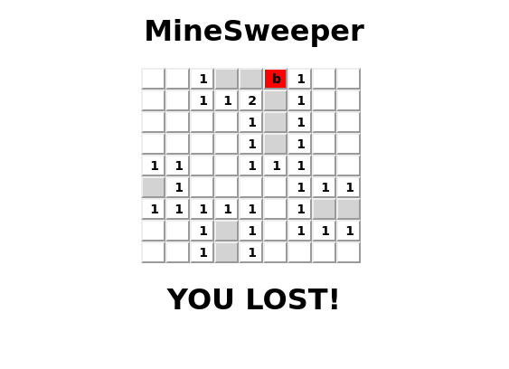

# MineSweeper

Browser based game of the classic game MineSweeper

[Live Link](https://brentluna.github.io/minesweeper/)



## Technologies

- JavaScript
- React.js

This game of minesweeper is built utilzing JavaScript to handle the game logic, and utilizes recursion to reveal adjacent spaces. The game is built with React components, that handle the rendering and eventHandler logic.

```javascript
Tile.prototype.explore = function () {
  if (this.flagged || this.explored) {
    return this;
  }

  this.explored = true;
  if (!this.bombed && this.adjacentBombCount() === 0) {
    this.neighbors().forEach(function(tile) {
      tile.explore();
    });
  }

};
```

## Todo

- Update styling
